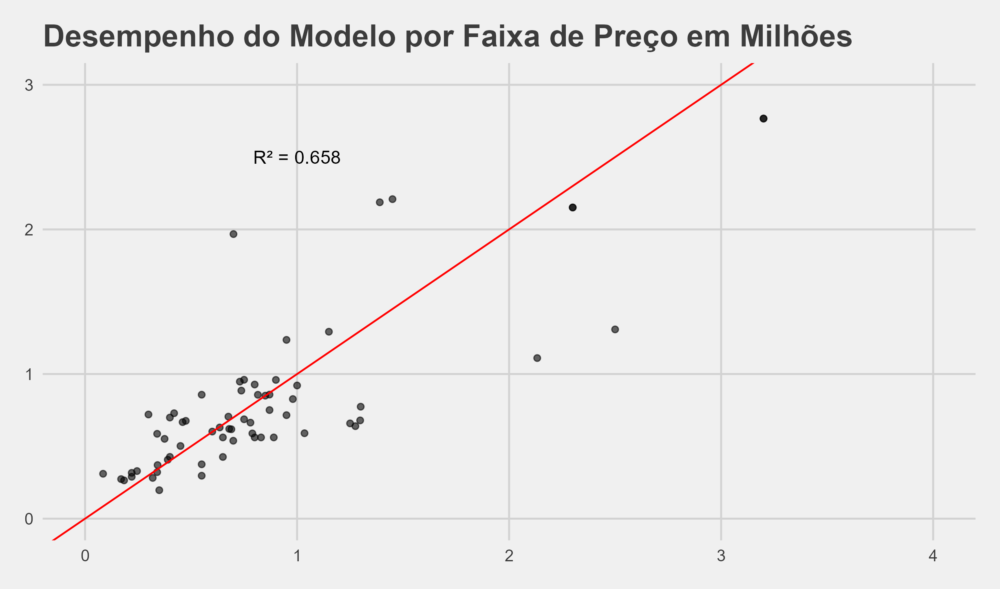

# Previsão de Preço de Imóveis no Espírito Santo 🏠📊

Projeto de análise e modelagem preditiva usando dados reais de imóveis. Exploramos variáveis como cidade (Serra, Vitória e Vila Velha), número de quartos, banheiros, vagas e preço.

## 📌 Objetivo

Prever o preço dos imóveis com base nas características do imóvel e localização.

## 📁 Estrutura
- `data/`: dados utilizados
- `modelo/`: arquivos de modelo treinado
- `Raspagem e simuacao.qmd`: script de Web Scraping (Quarto)
- `analise.qmd`: relatório reprodutível (Quarto)
- `testar_modelo.R`: script em R para testar o modelo

## 🧪 Modelo
- Tipo: Regressão Linear
- R² obtido: **0.706**
- Observações: Melhor desempenho nas faixas de preço intermediárias.

## 📈 Resultados

### 📊 Métricas do Modelo

| Métrica  | Valor          | Interpretação                         |
|----------|----------------|---------------------------------------|
| **R²**   | 0.706          | Explica 70.6% da variância nos preços |
| **RMSE** | R\$ 367,093.20 | Erro médio de ±R\$ 367k               |
| **MAE**  | R\$ 244,871.60 | Erro absoluto médio de R\$ 245k       |

## 🔧 Como rodar

1.  Clone o repositório
2.  Abra `preco_imoveis.Rproj` no RStudio
3.  Execute `analise.qmd` ou `testar_modelo.R`

## ⚠️ Aviso: Os dados utilizados neste projeto foram coletados da internet exclusivamente para fins educacionais e de portfólio. Nenhum dado será comercializado ou redistribuído.

Este projeto tem finalidade exclusivamente educacional e pessoal. Os dados utilizados foram coletados por meio de técnicas de web scraping com o objetivo de demonstrar habilidades em ciência de dados, e não serão comercializados, redistribuídos ou utilizados para fins comerciais.

O conteúdo raspado é de domínio público e permanece sob os direitos de seus respectivos proprietários. O uso aqui apresentado não representa a OLX nem tem qualquer vínculo com a plataforma.

## 📁 Sobre os Dados

Os dados utilizados foram coletados via web scraping da OLX, com foco em anúncios de imóveis em cidades do Espírito Santo.

**Por respeito aos termos de uso da plataforma, os dados brutos não são disponibilizados neste repositório.**

Caso deseje reproduzir a análise, consulte o arquivo [`web_scraping.qmd`](web_scraping.qmd) para executar o processo de coleta por conta própria.

O site da OLX é dinâmico, a ocorrência de *bugs* e *tibble* com dimensçao 0x0 não é descartada.

## 📌 Conclusões

- O modelo de regressão apresentou um desempenho **satisfatório** (R² = 0.706), especialmente na faixa de preços entre **500 mil e 1 milhão de reais**.
- Algumas variáveis (como número de quartos e garagens) mostraram **não linearidade** e até **inversões inesperadas** no comportamento dos preços.
- Há sinais de **desigualdade no mercado**, como evidenciado pela distribuição bimodal de preços em cidades como Vitória.

## 📚 Tecnologias

-   R
-   tidyverse
-   ggplot2
-   Quarto
-   ggthemes
-   viridis
-   caret
-   httr
-   rvest
-   MASS
-   usethis
